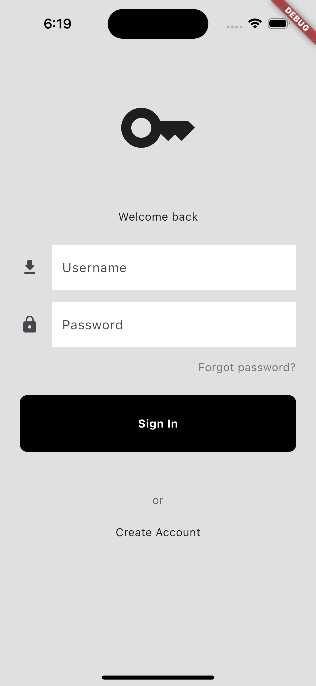

# flutter_auth_example

Sample authentication in flutter

## About

This project should consume the API from NESTJS Auth Example project

## Roadmap

- [x] Create Login Page
- [ ] Create Signup Page
- [ ] Log in to Backend
- [ ] Sign up to Backend
- [ ] View Dashboard
- [ ] Store access token securely
 

